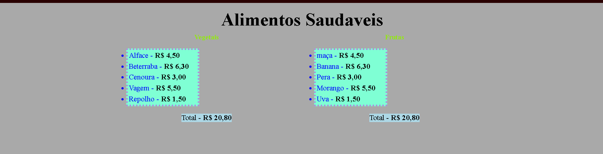
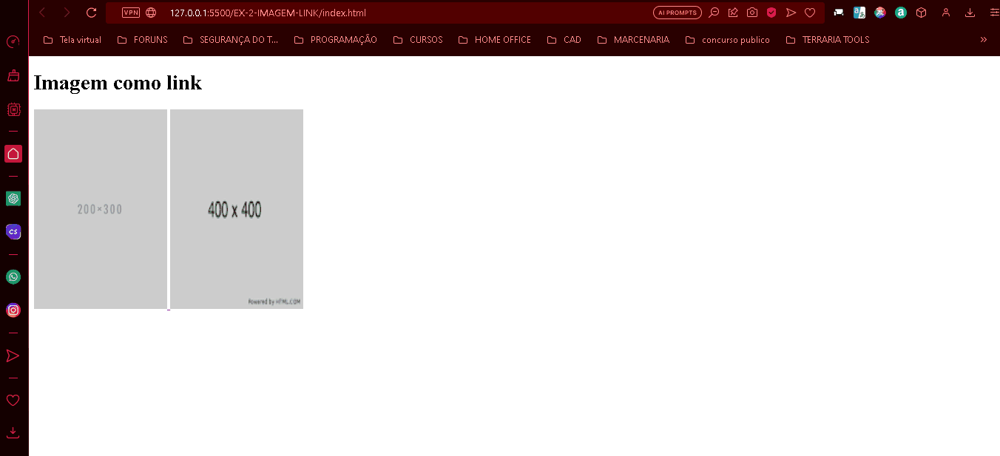
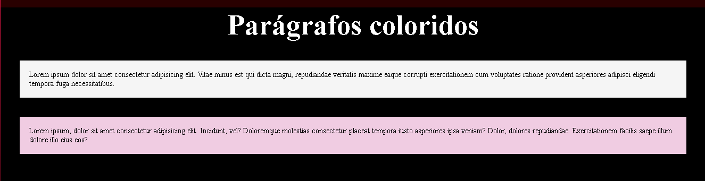

# Exercícios HTML e CSS Básico

Os exercícios foram em pastas separadas para melhor organização

## Exercício 1 - Lista de compras

## Exercício 2 - Imagem - link

## Exercício 3 - Parágrafos coloridos

